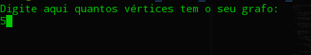
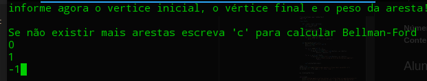
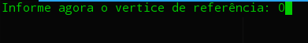
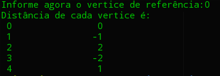

# Lista 5

**Número da Lista**: 5<br>
**Conteúdo da Disciplina**: Programação Dinâmica<br>

## Alunos

| Matrícula  | Aluno                       |
| ---------- | --------------------------- |
| 16/0070287 | Érico Maximiano Bandeira    |
| 17/0056155 | André Aben-Athar de Freitas |

## Sobre

O nosso projeto tem como entrada o número de arestas de um grafo e o peso de suas arestas e calcula o menor percurso para um destino específico.

## Screenshots

### Tela inicial:



### Tela para informar os vértices e pesos das arestas:



### Tela para mostrar a aresta de referencia:



### Tela para mostrar o resultado do Bellman-Ford:



## Instalação

**Linguagem**: Python3<br>

## Uso

para executar o programa num terminal linux basta escrever:

```
python3 project5.py
```
